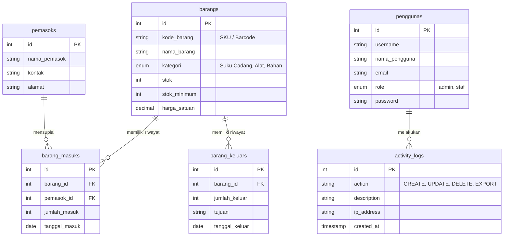

# 🚗 DOKUMENTASI TEKNIS & OPERASIONAL SISTEM
## GearFlow Inventory System (Sistem Manajemen Inventaris Bengkel Modern)

**Proyek Tugas Akhir / Perancangan Web — Universitas Teknologi Bandung**  
**Disusun oleh:** Luthfy Arief (23552011045)  
**Status Deployment:** Live Production Online (`https://www.garasifyy.site`)  
**Repositori GitHub:** [`tech0608/gearflow-inventory`](https://github.com/tech0608/gearflow-inventory)

---

## 1. 🌟 Ikhtisar Proyek (Project Overview)

**GearFlow Inventory System** adalah aplikasi berbasis web yang dirancang untuk mengotomatisasi pengelolaan stok suku cadang (*spare parts*), alat kerja mekanik, dan bahan habis pakai pada bengkel otomotif modern. Sistem ini menggantikan pencatatan manual berbasis kertas atau spreadsheet yang rawan kesalahan, kehilangan data, dan selisih stok.

### Spesifikasi Teknologi (Tech Stack):
* **Backend Framework:** Laravel 11 (PHP 8.3)
* **Database Engine:** MySQL / MariaDB (Relational Database)
* **Frontend Architecture:** Laravel Blade Templating + Vanilla CSS Custom Design System
* **UI/UX Aesthetics:** Premium Dark Mode, Glassmorphism, Micro-animations
* **Hardware Integration:** HTML5 WebRTC Webcam Scanner (Barcode & QR Code)
* **Production Server:** LiteSpeed / Nginx Web Server dengan PHP-FPM 8.3 & AutoSSL Let's Encrypt

---

## 2. 🛡️ Arsitektur Keamanan & Audit (Security Hardening)

Sistem ini menerapkan standar keamanan tingkat tinggi yang memenuhi kriteria *enterprise application*:

> [!IMPORTANT]
> **Role-Based Access Control (RBAC):**  
> Terdapat pemisahan wewenang yang tegas antara **Administrator** dan **Staf Bengkel**. Pendaftaran akun publik (*Self-Registration*) ditutup sepenuhnya untuk mencegah akses ilegal. Akun baru hanya dapat dibuat oleh Administrator.

1. **Proteksi Injeksi SQL (Anti-SQLi):** Menggunakan Eloquent ORM dengan *Prepared Statements* pada seluruh kueri database sehingga kebal terhadap manipulasi parameter masukan.
2. **Proteksi Cross-Site Scripting (XSS) & CSRF:** Seluruh formulir diamankan dengan token `@csrf` dan pemrosesan keluaran dinamis (termasuk data grafik Chart.js) diverifikasi menggunakan direktif `@json()`.
3. **Audit Trail (Activity Logging):** Setiap tindakan penting yang dilakukan pengguna (penambahan mitra pemasok, pengubahan data, hingga pengunduhan laporan CSV) dicatat secara otomatis di dalam tabel `activity_logs` beserta alamat IP dan waktu kejadian.
4. **Server Hardening:** Konfigurasi web server membatasi penelusuran direktori (*Directory Listing*), memblokir akses ke file sensitif (`.env`, `.git`), dan menerapkan HTTP Security Headers (*HSTS, X-Frame-Options, X-Content-Type-Options*).

---

## 3. 🚀 Fitur Unggulan & Nilai Tambah (Bonus Features)

Sistem ini melampaui standar aplikasi manajemen biasa dengan menyertakan fitur-fitur inovatif:

| Fitur Unggulan | Deskripsi & Manfaat |
| :--- | :--- |
| 📷 **Barcode & QR Scanner** | Memindai SKU barang langsung menggunakan kamera ponsel atau laptop pada saat transaksi masuk/keluar dan pencarian instan di daftar barang. |
| 🖨️ **Cetak Label QR Code** | Menghasilkan kode QR SKU beresolusi tinggi yang siap dicetak dan ditempel pada rak penyimpan atau kemasan suku cadang. |
| 📧 **Email Stok Kritis** | Sistem otomatis mengirimkan peringatan via email kepada Administrator apabila terdapat barang yang menyentuh batas stok minimum. |
| 🌙 **Modern Dark Mode** | Antarmuka bergaya gelap yang ergonomis, mengurangi kelelahan mata saat digunakan di lingkungan bengkel, serta hemat daya. |
| 📊 **Dashboard Analisis** | Menampilkan statistik real-time, grafik tren transaksi 7 hari terakhir, serta komposisi inventaris berdasarkan kategori. |
| 📑 **Export Excel (.CSV)** | Unduhan laporan data barang dan riwayat transaksi dengan filter tanggal yang kompatibel dengan Microsoft Excel (menggunakan BOM UTF-8). |

---

## 4. 🗄️ Struktur Database (Entity Relationship)

Sistem dirancang menggunakan 6 tabel utama dengan kesepadanan nomenklatur standar Inggris (`items`/`products`, `suppliers`, `incoming_items`, `outgoing_items`, `users`, `activity_logs`) yang saling berelasi:



---

## 5. 📖 Panduan Pengoperasion (User Manual)

### A. Akses Masuk (Login)
Buka peramban (browser) dan akses tautan live: **`https://www.garasifyy.site`**. Gunakan kredensial standar berikut:

* **Akun Administrator (Akses Penuh):**
  * **Username:** `admin` | **Password:** `admin123`
* **Akun Staf Bengkel (Transaksi & Laporan):**
  * **Username:** `staff` | **Password:** `password`

### B. Alur Kerja Pemindaian Barcode (Scan & Cari)
1. Masuk ke menu **Data Barang**.
2. Klik tombol biru **"📷 Scan Barcode / QR Cari"** di bagian atas tabel.
3. Arahkan kamera ponsel atau webcam laptop ke arah barcode / QR code yang menempel pada suku cadang.
4. Sistem akan mendeteksi kode secara otomatis dan melacak barang tersebut di tabel dalam waktu kurang dari 1 detik.

### C. Alur Pencatatan Transaksi
* **Barang Masuk:** Pilih menu *Barang Masuk → Tambah*. Kamu dapat memilih barang secara manual atau mengklik ikon kamera untuk memindai SKU barang yang datang dari pemasok. Stok akan bertambah otomatis.
* **Barang Keluar:** Pilih menu *Barang Keluar → Tambah*. Masukkan tujuan penggunaan (misal: *Servis Motor B 1234 XYZ - Ganti Oli*). Jika jumlah keluar melebihi stok yang ada, sistem akan menolak transaksi untuk mencegah stok minus.

---

## 6. 🛠️ Dokumentasi Deployment Server Produksi

Aplikasi ini telah sukses di-deploy pada layanan hosting cPanel LiteSpeed/Nginx dengan spesifikasi konfigurasi berikut:

1. **Pengaturan Domain & Versi PHP:**  
   Domain `garasifyy.site` diatur menggunakan **PHP 8.3 (`ea-php83`)** untuk menjamin performa maksimal dan kompatibilitas dengan Laravel 11.
2. **Keamanan SSL (HTTPS):**  
   Dilindungi oleh sertifikat **Let's Encrypt AutoSSL** berenkripsi 256-bit.
3. **Pengalihan Root (`.htaccess`):**  
   Dilengkapi aturan penulisan ulang (*URL Rewriting*) di root server sehingga pengunjung dapat langsung mengakses aplikasi tanpa perlu menambahkan `/public` pada URL:
   ```apache
   <IfModule mod_rewrite.c>
       RewriteEngine On
       RewriteRule ^(.*)$ public/$1 [L]
   </IfModule>
   ```
4. **Optimasi Caching Laravel:**  
   Pada lingkungan produksi, perintah artisan berikut telah dijalankan untuk mempercepat waktu pemuatan (*load time*):
   ```bash
   php artisan config:cache
   php artisan route:cache
   php artisan view:cache
   ```

---
*Dokumentasi ini dibuat secara resmi untuk melengkapi persyaratan evaluasi proyek sistem informasi.*
