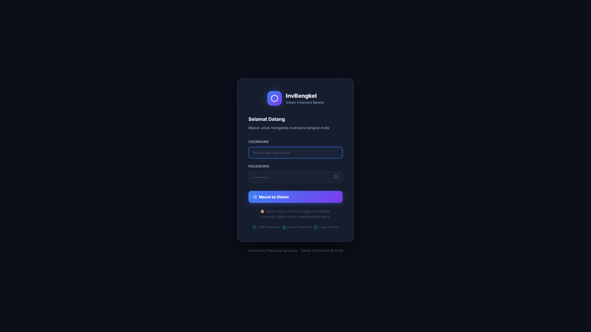
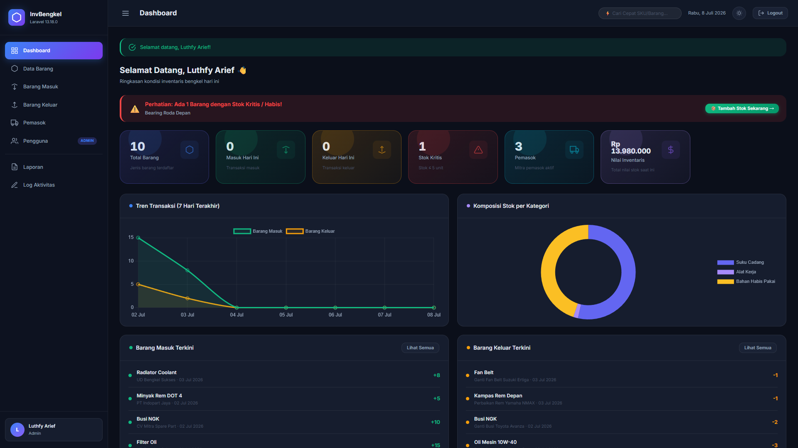
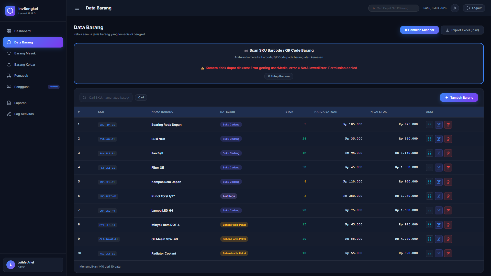
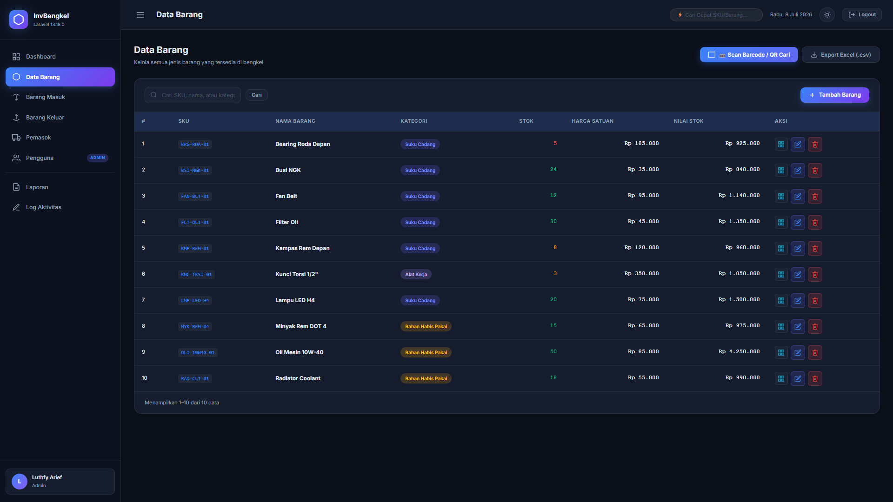

# 🚗 Sistem Inventaris Barang Bengkel
**Proyek Tugas Web — Universitas Teknologi Bandung**

[](https://laravel.com)
[](https://www.php.net/)
[](https://www.mysql.com/)
[](https://nginx.org/)

Sistem informasi manajemen inventaris suku cadang, alat kerja, dan bahan habis pakai untuk operasional bengkel modern. Dibangun menggunakan framework **Laravel 11** dengan arsitektur yang aman, responsif, dan siap didistribusikan pada server produksi (**Ubuntu / Nginx**).

---

## 🌟 Fitur Unggulan

### 1. Manajemen Data & Transaksi (CRUD Lengkap)
- **Data Barang:** Pengelolaan barang dengan kategorisasi (*Suku Cadang, Alat Kerja, Bahan Habis Pakai*), harga satuan, nilai total stok, dan batas stok minimum.
- **Data Pemasok:** Manajemen database mitra pemasok beserta kontak dan alamat.
- **Barang Masuk:** Pencatatan otomatis penambahan stok dari pemasok berdasarkan tanggal transaksi.
- **Barang Keluar:** Pencatatan otomatis pengurangan stok untuk kebutuhan perbaikan/servis dengan proteksi batas stok habis.

### 2. Peningkatan Fitur Tambahan (Nilai Bonus / Eksklusif)
- 🌙 **Dark Mode Modern:** Tampilan antarmuka gelap yang nyaman di mata, mewah, dan hemat daya.
- 📷 **Barcode / QR Code Scanner (Webcam & Smartphone):** Scan SKU langsung menggunakan kamera pada form Barang Masuk, Barang Keluar, serta untuk pencarian instan di daftar barang.
- 🖨️ **Cetak QR Code SKU:** Generate dan cetak label QR Code untuk ditempelkan pada rak atau kemasan suku cadang.
- 📧 **Email Notifikasi Stok Kritis:** Pengiriman email peringatan otomatis kepada Admin ketika stok barang menyentuh batas minimum.
- 📊 **Dashboard Analisis Chart.js:** Grafik interaktif tren transaksi 7 hari terakhir dan komposisi stok per kategori.
- 📑 **Export Laporan Excel (.CSV):** Unduh laporan data barang dan riwayat transaksi dengan filter rentang tanggal.

### 3. Keamanan Tingkat Lanjut (Security Hardening)
- **Role-Based Access Control (RBAC):** Pemisahan hak akses ketat antara **Admin** (kelola pengguna, hapus barang) dan **Staf** (operasional transaksi).
- **Proteksi Registrasi:** Penutupan rute registrasi publik untuk mencegah pembuatan akun liar. Akun hanya bisa dibuat oleh Admin.
- **Anti-SQL Injection:** Menggunakan Eloquent ORM dengan *Prepared Statements*.
- **CSRF & Rate Limiting:** Proteksi token CSRF pada seluruh formulir serta pembatasan percobaan login (max 5 kali/menit).
- **Audit Trail (Activity Log):** Pencatatan otomatis alamat IP dan riwayat setiap aktivitas penting dalam sistem.

---

## 📸 Tangkapan Layar (Screenshots)

### 1. Halaman Login Modern (Dark Mode)


### 2. Dashboard Analisis & Grafik Interaktif


### 3. Pemindai Barcode & QR Code (WebRTC Camera Scanner)


### 4. Manajemen Data Barang & Stok Minimum


---

## 🔑 Akun Default (Seeder)

Setelah melakukan instalasi database (`php artisan migrate --seed`), Anda dapat login menggunakan akun berikut:

| Role | Username | Password | Keterangan |
| :--- | :--- | :--- | :--- |
| **Administrator** | `admin` | `admin123` | Akses penuh seluruh modul & manajemen pengguna |
| **Staf Bengkel** | `budi` | `budi123` | Akses transaksi & laporan tanpa manajemen akun |

---

## 💻 Panduan Instalasi Lokal (Laragon / XAMPP)

1. **Klona atau Ekstrak Proyek:**
   ```bash
   git clone https://github.com/username/bengkel.git
   cd bengkel
   ```

2. **Install Dependensi:**
   ```bash
   composer install
   ```

3. **Konfigurasi Environment:**
   ```bash
   cp .env.example .env
   php artisan key:generate
   ```
   *Atur koneksi database (`DB_DATABASE=bengkel_db`) di dalam file `.env`.*

4. **Migrasi dan Seeding Database:**
   ```bash
   php artisan migrate --seed
   ```

5. **Jalankan Server:**
   ```bash
   php artisan serve
   ```
   Akses melalui browser di: `http://localhost:8000`

---

## 🚀 Panduan Deployment Server Produksi (Ubuntu & Nginx)

Proyek ini telah dilengkapi dengan konfigurasi siap pakai untuk hosting/server Linux:

1. **Konfigurasi Nginx:** Gunakan file `nginx-bengkel.conf` yang disediakan untuk mengatur Server Block Nginx dengan fitur *Security Hardening* dan *HTTP Security Headers*.
2. **Script Otomatis:** Gunakan script bash `deploy.sh` di server untuk menjalankan pembaruan secara otomatis:
   ```bash
   chmod +x deploy.sh
   ./deploy.sh
   ```

---

## 📁 Struktur Tabel Utama

1. `barangs` — Menyimpan katalog inventaris, SKU, harga, dan batas stok minimum.
2. `pemasoks` — Menyimpan data mitra penyedia barang.
3. `barang_masuks` — Riwayat transaksi masuk dan relasi pemasok.
4. `barang_keluars` — Riwayat transaksi keluar dan keterangan penggunaan.
5. `penggunas` — Menyimpan autentikasi, role admin/staf, dan email notifikasi.
6. `activity_logs` — Jurnal audit aktivitas sistem.

---
*Dikembangkan untuk memenuhi Tugas Perancangan Sistem Inventaris — Universitas Teknologi Bandung.*
